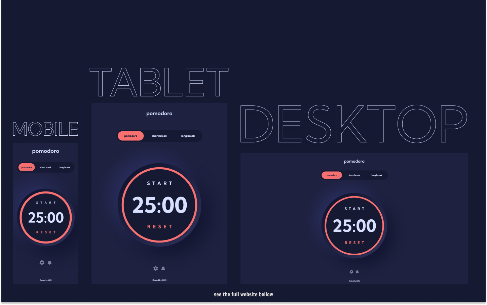

# Frontend Mentor - Pomodoro PWA Solution

This is a solution to the [Pomodoro PWA Challenge on Frontend Mentor](https://www.frontendmentor.io/challenges/pomodoro-app-KBFnycJ6G).

## Table of contents

- [Overview](#overview)
  - [The challenge](#the-challenge)
  - [Screenshot](#screenshot)
  - [Links](#links)
- [My process](#my-process)
  - [Built with](#built-with)
  - [What I learned](#what-i-learned)
  - [Continued development](#continued-development)
  - [Useful resources](#useful-resources)
- [Author's Links](#authors-links)

## Overview

### The challenge

Challenges provided by Frontend Mentor:

- Set a pomodoro timer and short & long break timers
- Customize how long each timer runs for
- See a circular progress bar that updates every minute and represents how far through their timer they are
- Customize the appearance of the app with the ability to set preferences for colors and fonts

Challenges added by me:

- Add sound effects for user interactivity and notifications, such as when the time is up
- Add animations and transitions for better visualization

### Screenshot

### Links

- Live Site URL: [https://pomodoro-app-mu-seven.vercel.app/](https://pomodoro-app-mu-seven.vercel.app/)
- Solution URL: [https://www.frontendmentor.io/solutions/pomodoro-pwa-built-w-nextjs-typescript-tailwind-and-framer-motion-OByffa8eQw](https://www.frontendmentor.io/solutions/pomodoro-pwa-built-w-nextjs-typescript-tailwind-and-framer-motion-OByffa8eQw)

## My process

### Built with

  

### What I learned

This was a great project to practice working with time, user inputs and multiple themes. I chose to use `React context` for state management, because it's not a massive app and I didn't want to over-engineer it with `redux` or any other state management system. As I already mentioned in one of my previous projects, `Tailwind` makes it really easy to build multi-theme websites, and in general it simplifies styling of the page. The more I use `TypeScript` the more I understand how it's getting more popular day-by-day. As always, I wanted to add my personal touch to the project, so I added some sound effects to enhance the interactivity of the app. Also, this will actually help to know when the time's up (I won't spoil anything anymore, go experience it yourself). I also didn't change dials for number inputs and left it as browser defaults. Why? Because of inconsistency of the browsers, some browser won't even hide the default dials, so it becomes very annoying to interact with the app when there are 2 types of dials. Other than that, I loved this project a lot, hope you will too.

### Continued development

I wanted to add push notifications, however, after testing with multiple browsers I came to the realization that it's not worth the time. Because again, the functionality is not consistent in browsers, and can do more harm than good by annoying the user. I hope it will get better soon, so we, web developers, can have that luxury of notifying the user as well.

### Useful resources

- [headlessUI](https://headlessui.com/) - Radio groups and dialog pop-ups can be pretty time-consuming to build from scratch, so I usually use headlessUI. Mainly because it's pretty simple and is compatible with Tailwind.

- [use-sound](https://github.com/joshwcomeau/use-sound#sprites) - If you were wondering how I added sound effects to the app, this is how.

## Author's Links

- Medium - [@kens_visuals](https://medium.com/@kens_visuals)
- CodePen - [@kens-visuals](https://codepen.io/kens-visuals)
- Codewars - [@kens_visuals](https://www.codewars.com/users/kens_visuals)
- Frontend Mentor - [@kens-visuals](https://www.frontendmentor.io/profile/kens-visuals)
